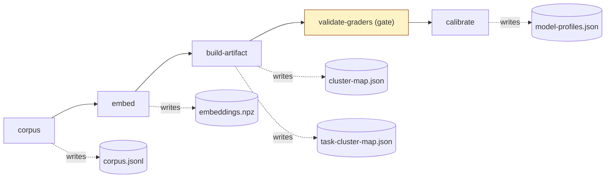
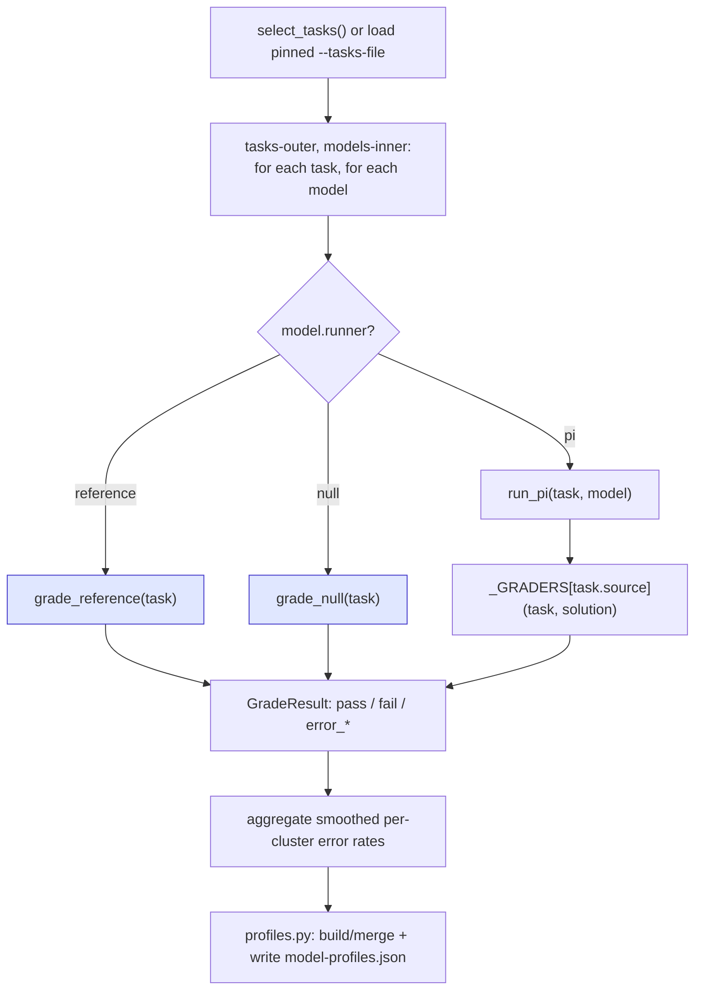
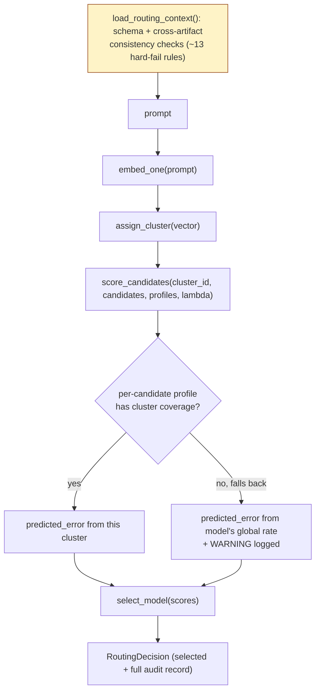
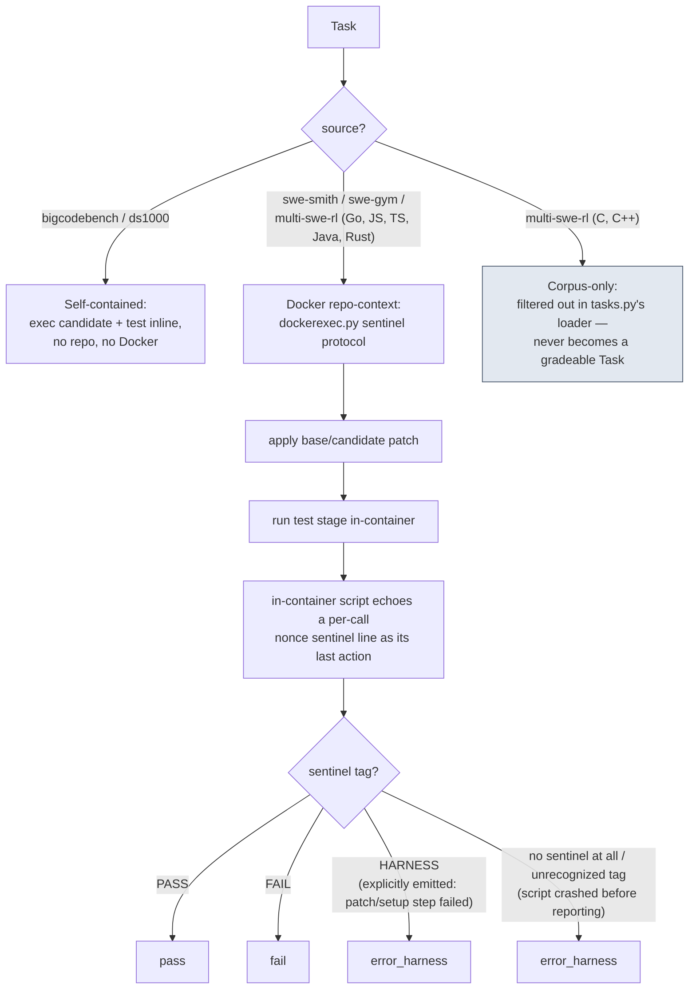

# Flows

Four diagrams: how the offline pipeline runs end to end, what happens inside one calibration call,
how a live routing decision is made, and how grading is dispatched per task source. Each diagram is
paired with a numbered walkthrough of what actually happens at each step, cited against the source
file/function that implements it.

These are intentionally high-level — several boxes hide real decision logic with their own
dedicated page:

- [outcomes.md](outcomes.md) — what's included vs. excluded from the final artifacts
- [scoring-formula.md](scoring-formula.md) — the routing score, worked out with real numbers
- [task-selection.md](task-selection.md) — stratified/category-mix task selection
- [runtime-validation.md](runtime-validation.md) — the runtime's ~13 hard-fail rules, in full
- [grading-protocol.md](grading-protocol.md) — the Docker sentinel/nonce protocol lifecycle
- [config-map.md](config-map.md) — which `config/*.yaml` feeds which stage
- [cli-reference.md](cli-reference.md) — every CLI command and flag, what it does, why you'd use it

## 1. Offline pipeline flow

1. **`corpus`** (`pipeline/corpus.py`) — loads 5 datasets (SWE-smith, SWE-Gym, BigCodeBench-Instruct,
   DS-1000, Multi-SWE-RL), tags each row with a stable, dataset-native `task_id`, dedups, writes
   `corpus.jsonl`.
2. **`embed`** (`pipeline/cli.py::_run_embed`) — embeds every corpus row in-process with
   `sentence-transformers` per `config/embedding.yaml`, writes `embeddings.npz`.
3. **`build-artifact`** (`cli.py::_run_build_artifact`) — runs k-means over the embeddings at
   `config/clustering.yaml`'s `default_k`, writes the validated `cluster-map.json`, and as a side
   effect writes `task-cluster-map.json` (every task's cluster label, keyed by the same stable id,
   so calibration can sample by cluster without re-embedding).
4. **`validate-graders`** (`cli.py::validate_graders`) — **gate, not a pipeline stage**: runs each
   gradeable source's own reference (gold) and null (empty) solution through its grader with no
   model involved. Reference must score ~100%, null ~0% — proves the grader itself discriminates
   correct from incorrect code before any real model result is trusted. A shortfall here must show
   up as `error_harness`/`error_timeout`, never as `fail`.
5. **`calibrate`** (`cli.py::calibrate`) — see the inner-loop diagram below. Writes
   `model-profiles.json`.

*See [config-map.md](config-map.md) for which config file feeds each of these stages.*

## 2. Calibration inner-loop flow

1. **Task selection** (`calibrate.py::select_tasks` / `select_verified_tasks`) — stratified sample
   across every cluster in `cluster-map.json`, respecting `config/calibration.yaml`'s
   `category_mix`. A `--tasks-file` (incremental `--model` runs) loads a previously-pinned
   selection instead, so a new model grades against the exact same task set an existing
   `model-profiles.json` was built from. *Full detail: [task-selection.md](task-selection.md).*
2. **Grading loop** (`calibrate.py::calibrate_models`) — tasks-outer, models-inner: for each task,
   grade it against every candidate model before moving to the next task (keeps Docker image
   affinity warm across models grading the same repo back to back).
3. **Runner dispatch** (`calibrate.py::run_and_grade`) — `model.runner` is one of:
   - `reference` / `null` — grader-validation controls, synthesized directly from the task's own
     gold/empty solution, no agent call.
   - `pi` — the real path: `runner.py::run_pi` invokes the Pi coding agent headlessly against the
     task's prompt, then the result is handed to `_GRADERS[task.source]` (`calibrate.py`'s
     per-source dispatch table — see the grading-dispatch diagram below for what happens inside).
4. **Outcome classification** — every call returns a `GradeResult` (`pass` / `fail` /
   `error_missing_dep` / `error_timeout` / `error_harness` / `error_no_solution`). Harness-shaped
   errors are excluded from a model's error rate rather than counted as a wrong answer. *Full
   detail: [outcomes.md](outcomes.md).*
5. **Aggregation + write** (`profiles.py`) — outcomes are smoothed into a per-cluster error rate
   per model, assembled into the profiles artifact, and written to `model-profiles.json`. A
   `--model`-scoped run merges just that model's entry into the existing file instead of
   overwriting the others (`merge_profiles_dict`). *The smoothing math: [scoring-formula.md](scoring-formula.md).*

## 3. Runtime request flow

1. **Validation gate** (`runtime/context.py::load_routing_context`) — a precondition, not part of
   the per-request flow: loads and cross-validates `cluster-map.json` and `model-profiles.json`
   (schema, matching embedding model, `profiles.cluster_map_id == cluster_map.artifact_id`, a
   non-negative finite lambda, and more), computing one reproducibility digest
   (`sha256` over lambda + both artifact ids + the candidate roster). Runs once per process, not
   once per request. *Every rule, in full: [runtime-validation.md](runtime-validation.md).*
2. **Embed** (`common/embedding.py::embed_one`, via `runtime/decide.py::decide`) — turns the raw
   prompt into a vector with the same embedding model the artifacts were built with.
3. **Assign** (`common/assign.py::assign_cluster`) — nearest-centroid assignment against
   `cluster-map.json`'s centroids.
4. **Score** (`common/scoring.py::score_candidates`) — for each candidate model:
   `predicted_error + lambda * normalised_cost`. `predicted_error` is looked up for the assigned
   cluster first; if that model has no calibration coverage for this cluster, it falls back to the
   model's *global* error rate and logs a WARNING (`decide_from_vector`) — the fallback is visible,
   not silent. *Worked example: [scoring-formula.md](scoring-formula.md).*
5. **Select + audit** (`common/scoring.py::select_model`, `runtime/decide.py::decide_from_vector`)
   — the lowest-scoring candidate is chosen; the full `RoutingDecision` (every candidate's score,
   which ones were excluded and why, the digest, timings) is returned as the audit record, not just
   the winner.

## 4. Grading-dispatch flow

1. **Self-contained sources** (`grading/bigcodebench.py`, `grading/ds1000.py`) — the candidate's
   code and the task's own test are exec'd directly in a subprocess; no repository, no Docker
   daemon needed.
2. **Docker repo-context sources** (`grading/swesmith.py`, `grading/swegym.py`,
   `grading/multiswerl.py`) — all three build on `grading/dockerexec.py`'s shared sentinel
   protocol: an in-container script applies the relevant patch, runs the test stage, and echoes a
   fresh per-call nonce + outcome tag as the very last thing it does before exiting 0 regardless of
   outcome — the sentinel line itself carries the real result, and candidate code can't forge it
   without guessing that call's fresh nonce. The tag is one of `PASS`, `FAIL`, or `HARNESS` —
   `HARNESS` is explicitly emitted whenever a setup/patch step fails (dataset's own patch not
   applying, missing repo dir, etc.), which is how *most* `error_harness` results actually arrive,
   not just an edge case. No sentinel at all, or an unrecognized tag, is the rarer fallback path —
   the script crashed before it could report anything, so `classify()` falls back to scanning for
   known daemon/image-error signatures. Either way it's classified `error_harness`, excluded from
   the model's error rate rather than counted as a wrong answer, since it's the *harness* that
   failed (bad image, setup crash, timeout), not the candidate.
   *Full protocol lifecycle: [grading-protocol.md](grading-protocol.md).*
3. **Multi-SWE-RL's language split** — only the Go, JS, TS, Java, and Rust slices are gradeable
   (`multiswerl.py`); C and C++ rows are filtered out in `tasks.py`'s loader *before* a `Task` is
   ever constructed for them — they exist in the clustering corpus but can never reach a grader at
   all, not because grading rejects them but because they're never offered to it.
