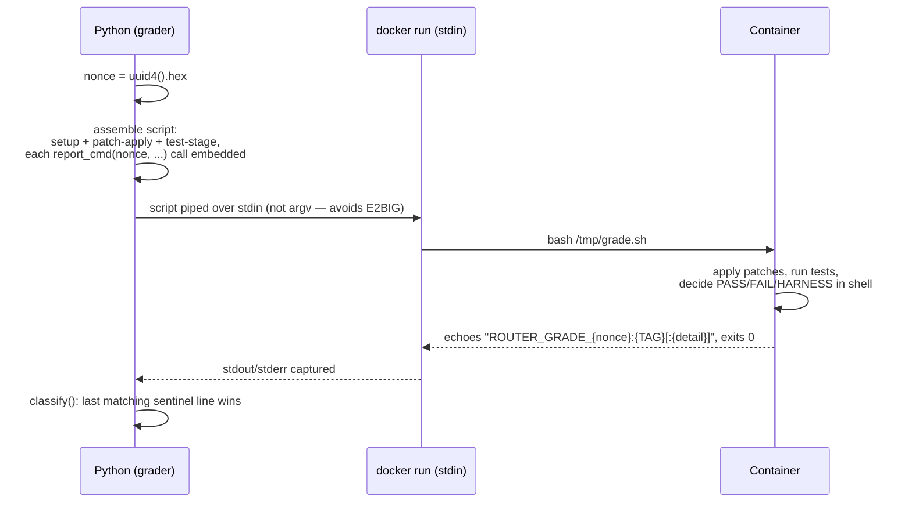

# The Docker grading sentinel protocol

`grading/dockerexec.py` is the shared infrastructure every Docker-based grader (SWE-smith,
SWE-Gym, Multi-SWE-RL) builds on: one `docker run`, one shell script piped over stdin, one
sentinel line the script echoes as its last action before exiting 0 — regardless of what actually
happened inside. This page is the full lifecycle behind the "Docker repo-context" branch in the
[grading-dispatch flow](README.md#4-grading-dispatch-flow).



## Why a nonce, not a fixed sentinel

A fixed sentinel string (e.g. a bare `"RESULT:"`) would be forgeable — pytest echoes captured test
stdout, and the candidate's own code is arbitrary, so a patch that simply prints the sentinel text
could fake a PASS. The nonce (`uuid4().hex`, fresh per call) makes that impractical: `sentinel(nonce)`
returns `f"ROUTER_GRADE_{nonce}:"`, and every in-container decision point calls
`report_cmd(nonce, tag, detail)` to emit it.

## The two invariants this module exists to enforce

1. **`fail` is reachable only via an in-container `FAIL` sentinel.** Anything else — a dead
   daemon, a missing image, a script that crashed before it could report — is *this project's*
   environment problem, not the candidate's, and must classify as `error_harness`, never `fail`.
2. **The script is never passed as a single argv element.** A large patch base64'd into
   `bash -c <script>` can exceed Linux's `MAX_ARG_STRLEN` (131,072 bytes) and crash `execve` with
   `E2BIG`. Streaming it over stdin instead (`docker run ... bash -c "cat > /tmp/grade.sh && exec
   bash /tmp/grade.sh"`) has no such limit.

## Building blocks graders compose

- **`write_file_cmd(text, dest)`** — base64-transports arbitrary text (a patch, a names file) into
  the container, sidestepping shell-quoting content the caller doesn't control.
- **`report_cmd(nonce, tag, detail)`** — `echo <sentinel line>; exit 0`. The container's own exit
  code becomes irrelevant once a sentinel line has been emitted.
- **`apply_patch_or_fail_cmd(nonce, patch_path, exclude_paths=...)`** — `git apply` the candidate's
  own patch, folding git's real stderr into the `FAIL` detail (capped at 500 chars) instead of a
  static message. `exclude_paths` (SWE-Gym/Multi-SWE-RL only) skips any hunk touching a file the
  task's own `test_patch` already owns — an agent's worktree never has `test_patch` applied, so a
  same-file edit would otherwise be captured against a baseline that no longer matches at grading
  time.
- **`pytest_collect_then_run(...)`** — shared by SWE-smith/SWE-Gym: collects every declared node id
  first, drops any pytest itself reports as uncollectable (a real, measured ~2.8% of SWE-Gym rows,
  usually a non-ASCII character escaped differently between dataset-collection time and the
  grading image's pytest), then runs the real pass only against the survivors — so one bad id can't
  lose all signal for the whole task.
- **`classify(nonce, returncode, stdout, stderr)`** — **pure**, no subprocess calls, so it's the one
  piece exercised directly by regression tests. Scans combined stdout+stderr line by line; the
  *last* matching sentinel line wins (no early `break`). No sentinel at all means the script never
  got to report — `classify` then falls back to scanning the output tail for known Docker-daemon or
  image-unavailable substrings before giving up with a generic `error_harness`.

## What each grader actually supplies

Every grader (`swesmith.py`/`swegym.py`/`multiswerl.py`) follows the same shape: build a per-mode
script (`_setup_script(task, nonce)` + a mode-specific middle step + a test-stage function, all
nonce-aware so their embedded `report_cmd` calls share one identity), then:

```python
try:
    return dockerexec.run(image, script, nonce, timeout_seconds, volumes=...)
finally:
    dockerexec.touch_image(image)
```

`touch_image` marks the image as most-recently-used and evicts the least-recently-used image only
once more than 15 distinct images are resident (`_MAX_CACHED_IMAGES`) — bounding resident disk to a
fixed ceiling while keeping recently-used images warm across the calibration loop's
tasks-outer/models-inner ordering (see `README.md`'s calibration inner-loop diagram).

See also: [README.md](README.md) (the grading-dispatch flow this protocol backs),
[outcomes.md](outcomes.md) (how a sentinel tag becomes a final `GradeResult` outcome).
