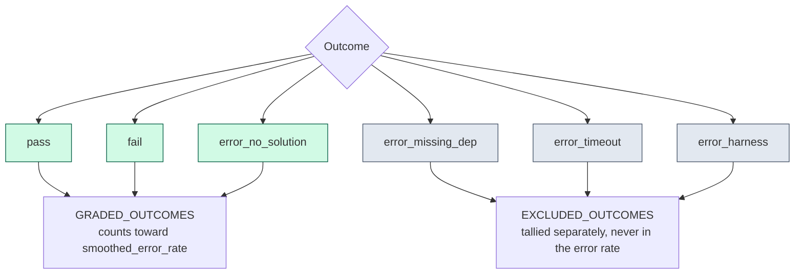

# Outcomes: what's included vs. excluded from the final artifacts

Every grading call — reference, null, or a real model via Pi — returns one of 6 outcomes
(`grading/base.py::Outcome`). Only 3 of them count toward a model's error rate; the other 3 are
excluded entirely — logged for visibility, but never treated as evidence the model got something
wrong.

## Included — `GRADED_OUTCOMES` (`pass`, `fail`, `error_no_solution`)

These are the only outcomes `calibrate.py::_stats_from_outcomes` counts: `n = len(graded)`,
`failed = sum(1 for o in graded if o != "pass")`. Both `fail` and `error_no_solution` count as a
failure — they just mean different things:

- **`pass`** — the candidate's solution passed grading.
- **`fail`** — the candidate produced something, and it was wrong. Includes an empty/malformed
  BigCodeBench solution (a `SyntaxError` on exec, since `code_prompt` ends mid-signature — that's
  a real failure, not a harness problem) and an empty Docker-based patch (`grading/swesmith.py`
  etc. return `fail` directly for `not solution.strip()`, "empty patch — bug remains unfixed").
- **`error_no_solution`** — the Pi agent produced *nothing usable at all* (`run_pi`'s
  `RunResult.solution is None`). Deliberately graded, not excluded — a model that never even
  attempted an answer is a real failure, not an infrastructure problem — see
  `calibrate.py::run_and_grade`.

## Excluded — `EXCLUDED_OUTCOMES` (`error_missing_dep`, `error_timeout`, `error_harness`)

Never factored into `n`/`failed` — `_stats_from_outcomes` tallies them separately into
`excluded_counts`, which lands in `model-profiles.json`'s per-model `excluded` block (e.g.
`{"error_timeout": 2, "error_harness": 95}`) purely for visibility. The reasoning is the same in
all three cases: a slow machine, a missing package, or a broken container must never look like a
bad model.

- **`error_missing_dep`** — BigCodeBench/DS-1000 only: any `ImportError`/`ModuleNotFoundError`
  anywhere during grading (harness setup *or* candidate code), including one raised mid-test and
  caught inside `unittest`'s own result object rather than propagating — see
  `grading/bigcodebench.py`'s module docstring. Treated as a stronger signal of an incomplete
  grading environment (a package genuinely not installed) than of a deliberate model mistake.
- **`error_timeout`** — the *grading* call itself timed out (e.g. a Docker container exceeding
  `DOCKER_TIMEOUT_SECONDS` or a source's `task_timeout_overrides`). Distinct from a Pi-call-level
  timeout, which is classified `error_harness` instead (see below) — `calibrate.py`'s own comment
  is explicit about this: "our own subprocess timeout, distinct from a grader's own
  `error_timeout` (the test run)."
- **`error_harness`** — everything else infrastructure-shaped: repo/context unavailable before Pi
  ever ran, Pi's own subprocess timing out, Pi exiting nonzero or the provider rejecting the call
  (`docs/engineering-notes.md`, "Pi exits 0 on a provider-level error"), no Docker sentinel ever
  emitted, a malformed sentinel tag, the Docker daemon or image being unreachable, and a
  ground-truth-invalid skip (`_ground_truth_invalid` — the task is synthesized straight to
  `error_harness` for every real model, with no grading call made at all, once the reference/null
  controls show this task's ground truth can't be trusted).

## Why this split exists

A model's `smoothed_error_rate` is meant to answer "how often does this model get the task wrong,"
not "how often did today's Docker daemon/network/timeout budget cooperate." Mixing the two would
punish a model for this project's own environment flakiness — the entire reason
`docs/engineering-notes.md::"Pi exits 0 on a provider-level error"` exists is a real incident where,
before this exclusion logic was in place, ~15% of one model's calls were miscounted as
`error_no_solution` (a real failure) instead of `error_harness` (excluded), because they were
actually the provider rejecting the call.

See also: [README.md](README.md) (where these outcomes fit in the calibration inner-loop),
[scoring-formula.md](scoring-formula.md) (how the resulting `smoothed_error_rate` feeds the routing
score).
