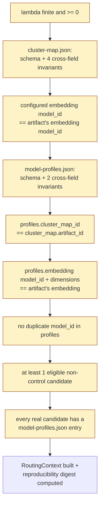

# The runtime's hard-fail validation rules

`runtime/context.py::load_routing_context` runs once per process (not once per request) and
hard-fails on any of the checks below rather than degrading — every rule here raises. This is the
gate the [runtime request flow](README.md#3-runtime-request-flow) shows as one box; this page lists
what's actually inside it.

## Direct checks (`load_routing_context`)

1. **Lambda is finite and non-negative** — `math.isfinite(lambda_) and lambda_ >= 0`.
2. **Configured embedding model matches the artifact's** — `config/embedding.yaml`'s `model_id`
   must equal the `model_id` recorded in `cluster-map.json`'s own `embedding` block. The runtime
   never trusts `config/embedding.yaml` directly for the actual embedding config used (see
   `docs/engineering-notes.md`, "Embedding config source of truth") — this check exists purely to
   catch a machine whose config drifted from what the artifact was actually built with.
3. **`model-profiles.cluster_map_id == cluster-map.artifact_id`** — the two artifacts must have
   been built together; otherwise cluster ids would be silently permuted between them.
4. **`model-profiles.embedding` matches the artifact's embedding** (both `model_id` and
   `dimensions`) — calibration tasks were clustered with the same embedding model the runtime is
   using now.
5. **No duplicate `model_id` in `model-profiles.json`.**
6. **At least one eligible (non-control) candidate is configured** — `reference`/`null` runner
   entries are never eligible to be routed to.
7. **Every real candidate has a `model-profiles.json` entry** — a configured candidate with no
   calibration profile is a hard startup failure, not a silent exclusion: "run calibration for
   them before they can be routed to."

## Bundled checks (schema + cross-field invariants)

Both artifacts go through the same two-layer validation (`common/artifacts.py`): standard JSON
Schema structural checks, plus invariants the schema itself can't express.

**`cluster-map.json`** (`check_cluster_map_invariants`):
- `len(clusters) == kmeans.k`
- cluster ids are contiguous, `0..k-1`, in ascending order
- every centroid's length equals `embedding.dimensions`
- no centroid contains a non-finite value (NaN/Infinity) — see `docs/engineering-notes.md`, "NaN
  centroid guard"

**`model-profiles.json`** (`check_profiles_invariants`):
- every cluster key a model reports falls within `0..cluster_count-1` (when `cluster_count` is
  present — it's optional, see `docs/engineering-notes.md`, "profiles.json's cluster_count is
  optional")
- for every scope (`global` and each cluster), `number_succeeded + number_failed == number_of_tasks`

Once every check passes, `load_routing_context` computes one reproducibility digest —
`sha256` over lambda + both artifacts' ids + the sorted candidate roster (id, `cost_input`,
`cost_output`) — so "did anything that could change a decision actually change between run A and
run B" is answerable without re-deriving it from scratch. Byte-exact embedding vectors aren't
reproducible across runs (fp16 vs fp32, batch composition, kernel differences), so the digest
deliberately covers everything *except* the embedding itself — what's reproducible is the decision
given the vector, not the vector's exact bytes.

See also: [README.md](README.md) (the full runtime request flow this gate precedes),
[config-map.md](config-map.md) (which config file feeds which of these checks).
