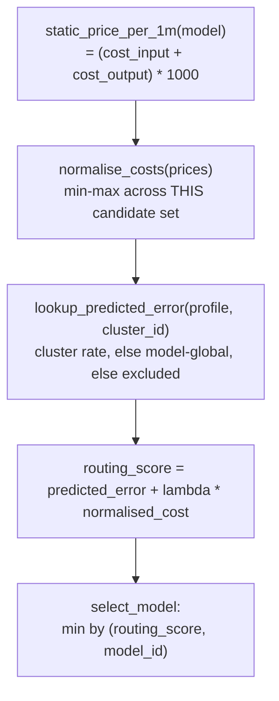

# The scoring formula, worked out

`routing_score = predicted_error + lambda * normalised_cost` (`common/scoring.py::score_candidates`)
— shared between the offline evaluator and the online runtime so both use the exact same formula
and tie-break rule.



## 1. Price, then normalise — per candidate SET, not a fixed scale

`static_price_per_1m` converts a model's `cost_input`/`cost_output` (stored as $/1k tokens in
`config/models.yaml`) to $/1M, purely for readability against published pricing — the formula
itself is scale-invariant. `normalise_costs` then min-max scales those prices to `[0, 1]` **across
whichever candidates are actually being scored for this request**, not against some fixed global
price range:

```
normalised = (price - min(prices)) / (max(prices) - min(prices))
```

If every eligible candidate happens to be the same price (e.g. an all-local set), the span is 0
and every `normalised_cost` is `0.0` — the cost term vanishes for all of them, correctly: cost
isn't a differentiator when nothing actually differs.

## 2. Predicted error — smoothed at calibration time, looked up at runtime

`smoothed_error_rate` isn't the raw per-cluster failure rate — it's shrunk toward the model's own
global rate at calibration time (`calibrate.py::_stats_from_outcomes`), so a lucky (or unlucky)
handful of tasks in a thin cluster doesn't read as a falsely-confident number:

```
smoothed = (n_failed + prior_weight * global_raw_error_rate) / (n_tasks + prior_weight)
```

`prior_weight` (`config/calibration.yaml`'s `smoothing.prior_weight`, currently `5`) acts as a
pseudo-count toward the global rate — higher means trust a thin cluster's own number less. Worked
example: a cluster where a model went 1-for-4 (`raw_error_rate = 0.75`) but the model's *global*
error rate across all clusters is `0.20`:

```
smoothed = (3 + 5 * 0.20) / (4 + 5) = 4.0 / 9 = 0.444
```

— pulled from 0.75 down to 0.444, not all the way to the global 0.20, since 4 real data points
still carry *some* weight. At global scope itself, there's no "more global" number to shrink toward,
so `_stats_from_outcomes` shrinks toward the raw rate itself, making `smoothed == raw` there by
construction. This computation happens once, during calibration, and gets written straight into
`model-profiles.json` — the runtime never recomputes it.

At runtime, `lookup_predicted_error(profile_entry, cluster_id)` just reads that stored value back:
the assigned cluster's `smoothed_error_rate` first; if that model has no calibration coverage
there, it falls back to the model's `global` rate instead (`error_source: "model-global"`) — logged
as a WARNING at the call site (`runtime/decide.py::decide_from_vector`), never silent. A model with
no profile entry at all for either scope is dropped from scoring entirely (excluded, never
defaulted to some rate).

See [outcomes.md](outcomes.md) for which outcomes (`pass`/`fail`/`error_no_solution`) feed
`n_failed`/`n_tasks` in the first place.

## 3. Worked example

Three candidates scored for cluster 4, `lambda = 0.05`:

| Model | `cost_input`+`cost_output` ($/1k) | $/1M | `smoothed_error_rate` (cluster 4) |
|---|---|---|---|
| `gpt-5-nano` | 0.0003 | 0.30 | 0.18 |
| `claude-haiku-4.5` | 0.006 | 6.00 | 0.09 |
| `gpt-5.6-luna` (no cluster-4 coverage) | 0.010 | 10.00 | 0.14 (global fallback) |

Normalising the 3 prices (min 0.30, max 10.00, span 9.70):

| Model | `normalised_cost` | `routing_score = error + 0.05 * norm_cost` |
|---|---|---|
| `gpt-5-nano` | (0.30-0.30)/9.70 = **0.000** | 0.18 + 0.05×0.000 = **0.1800** |
| `claude-haiku-4.5` | (6.00-0.30)/9.70 = **0.588** | 0.09 + 0.05×0.588 = **0.1194** |
| `gpt-5.6-luna` | (10.00-0.30)/9.70 = **1.000** | 0.14 + 0.05×1.000 = **0.1900** |

`select_model` picks the minimum `routing_score` — **`claude-haiku-4.5` wins** here even though
it's 20x more expensive than `gpt-5-nano`, because its cluster-specific error rate is low enough
that the `lambda`-weighted cost penalty doesn't overcome it. Raise `lambda` and the cheap-but-less-
accurate `gpt-5-nano` would eventually win instead — that crossover is exactly what
`config/calibration.yaml`'s `lambda_sweep` is for measuring during evaluation.

## 4. Tie-break

`select_model` uses `min(scored, key=lambda s: (s.routing_score, s.model_id))` — ties on
`routing_score` (common with an all-local, same-price candidate set) break alphabetically by
`model_id`, deterministically, not by insertion order.

See also: [README.md](README.md) (where scoring sits in the full runtime request flow),
[outcomes.md](outcomes.md) (what outcomes feed `smoothed_error_rate`).
