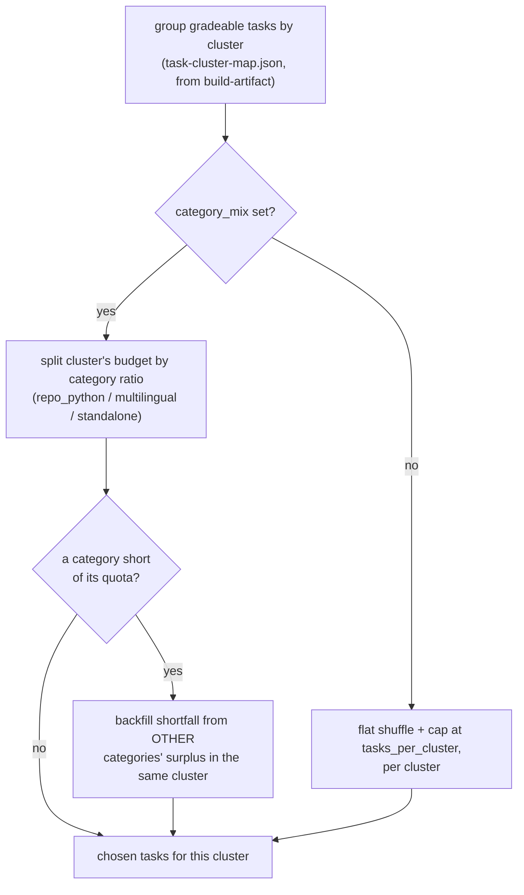

# Stratified task selection

`calibrate.py::select_tasks` decides which tasks a calibration run actually grades — stratified by
cluster, and (when configured) further split by category within each cluster's budget. Fast and
pure: no grading calls, no Docker.

## 1. Group by cluster

`_group_gradeable_tasks_by_cluster` loads every gradeable source's full row data
(`load_gradeable_tasks`) and groups it by the cluster label already computed once at
`build-artifact` time (`task-cluster-map.json`) — not re-derived per calibration run. It first
hard-fails if `task-cluster-map.json` wasn't built against the *current* `cluster-map.json`
(`cluster_map_id` mismatch), since a stale mapping would silently make cluster ids mean something
different than the centroids being used.

## 2. Flat mode (no `category_mix`)

If `config/calibration.yaml`'s `category_mix` is empty (the default), each cluster's tasks are
shuffled (seeded, deterministic) and capped at `tasks_per_cluster` — no category targeting at all.

## 3. Category-mix mode

Each gradeable source belongs to exactly one fixed category (`calibrate.py::CATEGORY_SOURCES` — a
property of what the dataset *is*, not configurable):

| Category | Sources |
|---|---|
| `repo_python` | swe-smith, swe-gym |
| `multilingual` | multi-swe-rl |
| `standalone` | bigcodebench, ds1000 |

`config/calibration.yaml`'s `category_mix` sets the *target ratio* per category (must sum to
~1.0, and — enforced by `_validate_category_mix` — must list every known category explicitly, even
if only to set it to `0.0`; an omitted category would otherwise be silently never selected with no
warning). `_select_with_category_mix` then:

1. Converts each category's ratio into an integer quota of the cluster's `tasks_per_cluster`
   budget (the *last* category in config order absorbs the rounding remainder, so quotas always
   sum to exactly the budget — never off by one from independent per-category rounding).
2. Takes the first `quota` tasks per category (shuffled, seeded).
3. **Backfills shortfalls.** A cluster naturally dominated by one source (real example: one
   cluster in an actual run was 100% BigCodeBench) can't fill every category's quota. Any
   unfilled quota is redistributed across the *other* categories' leftover tasks in the same
   cluster, so the cluster's total selection still hits `tasks_per_cluster` where possible instead
   of quietly under-filling it.
4. Logs which clusters needed backfilling, plus the globally *achieved* category mix — the spec
   says "approximately" 60/25/15, not exactly, so don't expect a perfect split of the total
   selection.

## 4. Determinism

`random.Random(calibration_config.seed)` is threaded through the whole selection — the same config
+ cluster map + task-cluster-map always produces the same selection, which is what makes
`--tasks-file` (pinning a selection for a later incremental `--model` run) meaningful: a new model
grades against the *exact* set an existing `model-profiles.json` was built from, not a freshly
re-derived one that happens to usually match.

See also: [README.md](README.md) (where task selection sits in the calibration inner-loop),
[outcomes.md](outcomes.md) (what happens to a selected task once it's actually graded).
